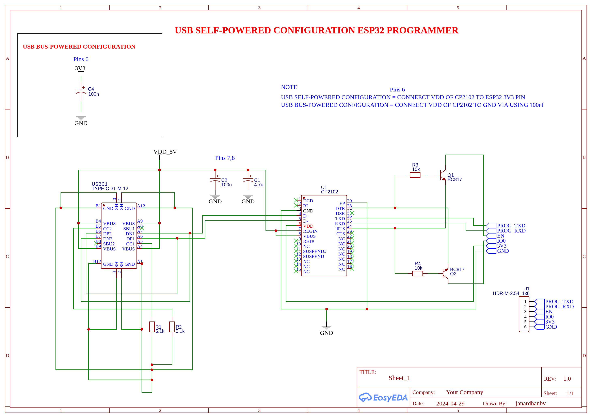
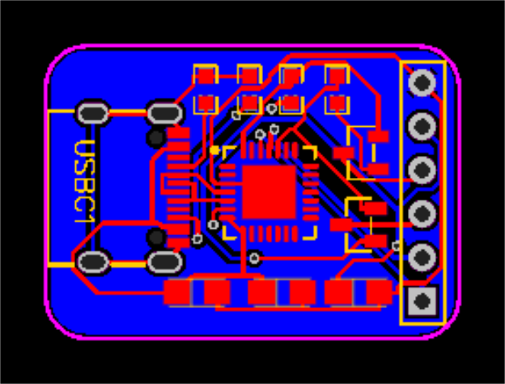
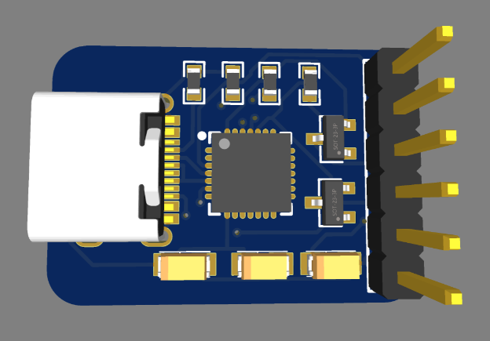
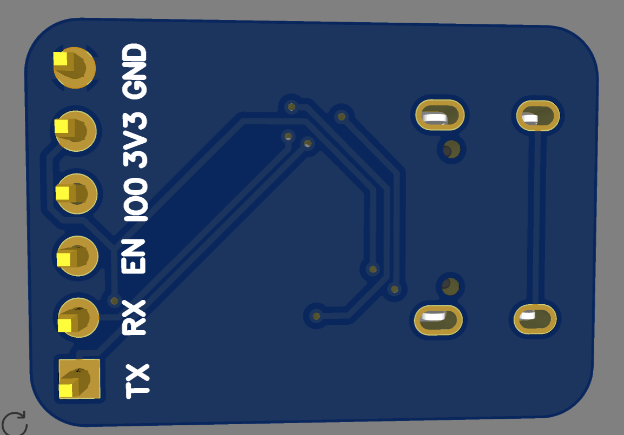

# 🔌 USB ESP32 Programmer — CP2102 USB Type-C to UART Bridge with Auto-Reset

---

## 📌 Project Overview

This project is a **compact USB-to-UART programmer** for ESP32 microcontrollers, built around the **Silicon Labs CP2102** single-chip USB-to-UART bridge and a **USB Type-C** connector. It includes an **automatic reset circuit** using two **BC817 NPN transistors** that toggle the ESP32's `EN` (reset) and `IO0` (bootloader select) pins via the CP2102's `DTR` and `RTS` control signals — enabling one-click flashing from Arduino IDE, PlatformIO, or `esptool.py` without pressing any buttons.

The board supports two power modes:
- **USB Self-Powered:** CP2102 VDD sourced from the ESP32's 3V3 rail
- **USB Bus-Powered:** CP2102 powered from USB 5V via its internal 3.3V regulator

The design covers:
- Full **schematic capture** in EasyEDA
- **Compact 2-layer PCB layout** with USB Type-C input and 6-pin header output
- **Auto-programming circuit** for seamless ESP32 flashing
- **Dual power configuration** support via VDD pin strapping

---

## 🖼️ Project Visuals

### Schematic


### PCB Layout


### 3D Board Top View


### 3D Board Bottom View



---

## ⚙️ How It Works

### USB to UART Bridging
The **CP2102** converts USB 2.0 Full Speed (12 Mbps) data to asynchronous UART signals (TX/RX). It includes an integrated USB transceiver, oscillator, and EEPROM — requiring **no external crystal or pull-up resistors**. The UART output is available on the 6-pin output header (J1) as `PROG_TXD` and `PROG_RXD`.

### Auto-Reset / Auto-Boot Circuit
The ESP32 enters **bootloader mode** when `IO0` is pulled LOW during a reset (`EN` goes LOW then HIGH). This is automated via two NPN transistors:

```
DTR (CP2102 Pin 29) ──► R3 (10kΩ) ──► Base of Q1 (BC817)
                                         └── Collector ──► EN pin (ESP32 Reset)

RTS (CP2102 Pin 28) ──► R4 (10kΩ) ──► Base of Q2 (BC817)
                                         └── Collector ──► IO0 pin (ESP32 Boot)
```

When `esptool.py` or Arduino IDE initiates a flash:
1. **RTS LOW + DTR HIGH** → Q2 off (IO0 high), Q1 on (EN pulled low = RESET)
2. **RTS HIGH + DTR LOW** → Q2 on (IO0 pulled low = BOOT mode), Q1 off (EN released = chip starts)
3. ESP32 boots into **UART Download Mode** automatically

---

## 📊 Component BOM

| Ref | Component | Value / Part | Function |
|:---:|:---|:---|:---|
| U1 | USB-UART Bridge IC | CP2102 (QFN-28, 5×5mm) | USB to UART conversion |
| USBC1 | USB Connector | TYPE-C-31-M-12 | USB Type-C input |
| Q1, Q2 | NPN Transistor | BC817 (SOT-23) | Auto-reset switching |
| R1, R2 | Resistor | 5.1 kΩ | CC1/CC2 pull-down (USB-C config) |
| R3, R4 | Resistor | 10 kΩ | Base current limiting for BC817 |
| C1 | Capacitor | 4.7 µF | Bulk supply decoupling |
| C2 | Capacitor | 100 nF | HF supply bypass |
| C4 | Capacitor | 100 nF | VDD config cap (Bus-powered mode) |
| J1 | Header | HDR-M-2.54_1×6 | 6-pin ESP32 programming header |

---

## 🔌 Output Header Pinout — J1 (HDR-M-2.54 1×6)

| Pin | Signal | Description |
|:---:|:---:|:---|
| 1 | PROG_TXD | CP2102 TX → ESP32 RX |
| 2 | PROG_RXD | CP2102 RX ← ESP32 TX |
| 3 | EN | ESP32 Enable / Reset |
| 4 | IO0 | ESP32 GPIO0 / Boot select |
| 5 | 3V3 | 3.3V power output |
| 6 | GND | Ground |

---

## ⚡ Power Configuration

The CP2102 VDD pin can be configured in two modes depending on your application:

### Mode 1 — USB Self-Powered (Default for ESP32 boards with own supply)
```
CP2102 VDD ──────────────── ESP32 3V3 PIN
```
- CP2102 is powered by the ESP32's onboard 3.3V regulator
- USB only provides data; no power drawn from USB VBUS for CP2102

### Mode 2 — USB Bus-Powered (Standalone USB-powered operation)
```
CP2102 VDD ── C4 (100nF) ── GND
```
- CP2102 uses its **internal 3.45V regulator** fed from USB VBUS (5V)
- C4 acts as a bypass cap on VDD
- USB powers both the CP2102 and the ESP32 (via 3V3 output on J1 Pin 5)

> ⚠️ **Never connect both configurations at the same time.**

---

## 🔩 IC Specifications — CP2102

| Parameter | Value |
|:---|:---|
| Manufacturer | Silicon Labs |
| USB Standard | USB 2.0 Full-Speed (12 Mbps) |
| UART Baud Rate | 300 bps to 1 Mbps |
| Package | QFN-28, 5×5 mm |
| Supply Voltage | 3.0V – 3.6V (VDD) |
| VBUS Input | 4.0V – 5.25V |
| Operating Current | ~26 mA (active), ~900 µA (suspend) |
| Internal Regulator | 3.3V and 3.45V outputs |
| EEPROM | 1024 bytes (vendor ID, product ID, serial) |
| OS Support | Windows, macOS, Linux (VCP drivers) |
| External Crystal | Not required (integrated oscillator) |

---

## 🔵 USB Type-C CC Pin Configuration

The USB Type-C connector uses **CC1 and CC2 pins** to negotiate power and orientation. For a USB device (not host), both CC pins require **5.1kΩ pull-down resistors** to GND:

```
CC1 ──► R1 (5.1kΩ) ──► GND
CC2 ──► R2 (5.1kΩ) ──► GND
```

This tells the USB host that the device accepts **5V / up to 900mA** (USB 2.0 default current), and enables cable plug orientation detection.

---

## 📐 PCB Design Highlights

- **EDA Tool:** EasyEDA (Schematic + PCB Layout)
- **Layer Stack:** 2-layer PCB
- **Board Shape:** Compact rounded-corner form factor
- **USB Input:** USB Type-C (TYPE-C-31-M-12) on left side
- **Programming Header:** 6-pin 2.54mm gold pin header on right side
- **IC:** CP2102 QFN-28 placed centrally for short USB D+/D– traces
- **Transistors:** Q1, Q2 (BC817 SOT-23) placed close to J1 header
- **Decoupling:** C1 (4.7µF) + C2 (100nF) on VDD_5V supply rail

---

## 🧪 Testing & Verification

### Step 1 — Hardware Inspection
- Verify CP2102 orientation (QFN-28 pin 1 marker)
- Check R1, R2 (5.1kΩ) on CC1/CC2 — critical for USB-C detection
- Confirm Q1, Q2 (BC817) polarity — emitter to GND

### Step 2 — USB Enumeration Test
- Connect USB Type-C cable to PC
- Device should enumerate as **Silicon Labs CP210x USB to UART Bridge**
- Verify in Device Manager (Windows) or `dmesg` (Linux): `/dev/ttyUSB0`

### Step 3 — Loopback Test
- Short PROG_TXD (Pin 1) to PROG_RXD (Pin 2) on J1
- Open serial terminal at 115200 baud
- Type any character — it should echo back (loopback confirmed)

### Step 4 — ESP32 Programming Test
- Connect J1 to ESP32 (TXD→RXD, RXD→TXD, EN→EN, IO0→IO0, 3V3→3V3, GND→GND)
- Flash using Arduino IDE or `esptool.py`
- Verify auto-reset: ESP32 should enter bootloader and flash without button press

---

## 🖥️ Driver Installation

| OS | Method |
|:---|:---|
| Windows | Install [Silicon Labs VCP Driver](https://www.silabs.com/developers/usb-to-uart-bridge-vcp-drivers) |
| macOS | Built-in since macOS 10.9+ |
| Linux | Built-in kernel module (`cp210x`) |

```bash
# Linux — verify enumeration
dmesg | grep cp210x

# Flash ESP32 with esptool
esptool.py --port /dev/ttyUSB0 --baud 460800 write_flash 0x0 firmware.bin
```

---

## 📁 Repository Structure

```
USB-ESP32-Programmer/
├── images/
│   ├── SCH.jpg              ← Full schematic
│   └── TopView.jpg          ← 3D board render
├── Gerber/
│   └── (Gerber files for PCB fabrication)
├── BOM/
│   └── BOM_USB_ESP32_Programmer.csv
└── README.md
```

---

## ⚠️ Design Notes & Cautions

- **Do not exceed 3.6V on CP2102 VDD** — internal regulator provides 3.3V from VBUS
- **R1, R2 (5.1kΩ CC pull-downs) are mandatory** for USB Type-C to function — without them the host may not provide power or data
- **BC817 base resistors (R3, R4 = 10kΩ)** limit GPIO current from CP2102 control pins — do not remove
- In **Self-Powered mode**, ensure ESP32 3V3 rail is stable before USB enumeration
- For USB-C hosts with strict PD negotiation, ensure VBUS is present before attempting enumeration

---

## 📄 License

This project is open for educational and personal use.  
© 2024 Janardhan BV — All rights reserved.

---

## 🙋 Author

**Janardhan BV**  
Embedded Hardware Engineer | PCB Design | Power Electronics  
📍 Bengaluru, India

---
*Designed in EasyEDA | USB Type-C ESP32 Auto-Programmer using CP2102*
